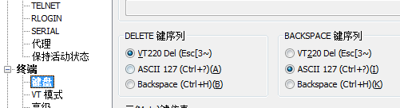

# ---
title: Ubuntux下搭建开发环境（一）
date: 2016-09-05 08:24:43
tags: 搭建环境
---
## 下载并在虚拟机中安装长期支持版的ubuntu（这里使用16.04）

### 安装ssh服务
默认情况先ubuntu会安装ssh-client， 但是我们要安装ssh-server
步骤：
1. 看下是不是安装了ssh
whereis ssh    看是不是安装了客户端
whereis sshd   看是不是安装了服务器端
<!-- more -->
2. 看服务有没有起来
ps -e | grep ssh
1698 ?  00:00:00 ssh-agent
4473 ?  00:00:00 sshd
如果只有ssh-agent说明ssh-server还没有启动，需要/etc/init.d/ssh start；
如果看到sshd那说明ssh-server已经启动了。
启动ssh服务用 service ssh start/restart
3. 配置
ssh-server配置文件位于/ etc/ssh/sshd_config,允许密码登录
PermitRootLogin prohibit-password
PermitRootLogin yes
然后重启SSH服务： sudo/etc/init.d/ssh restart

### windows下安装ssh客户端Xshell
1. 解决delete乱码问题
文件-属性

### 使用vsftp服务
[vstp服务搭建参考](http://jingyan.baidu.com/article/67508eb4d6c4fd9ccb1ce470.html)

### 配置使用samba服务器
[samba服务搭建参考](http://jingyan.baidu.com/article/00a07f38b9194082d028dc08.html)

#### 将linux共享目录映射到windows的网络驱动器
    运行--\\192.168.145.132--右键映射网络驱动器
### 挂载windows下共享目录到linux下
    sudo apt install cifs-units