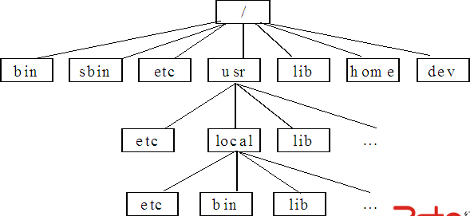
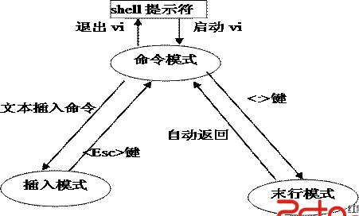

### 1 linux 概述
#### 1.1 linux 结构
##### 1.1.1 linux的四部分
　　　　可以把Linux系统看作由四部分构成：内核、用户界面、文件结构和实用工具

<!-- more -->

/bin 普通用户的可执行文件，系统的任何用户都可以执行该目录中的命令
/boot 存放Linux操作系统启动时所需要的文件
/dev 系统中所有设备文件
/etc 系统中的配置文件
/home 普通用户的宿主目录，每个用户在该目下都有一个于用户名同名的目录。
/mnt 中的子目录用于系统中可移动设备的挂载点
/root 超级用户root的宿主目录
/sbin 系统中的管理命令，普通用户不能执行
/tmp 系统的临时目录
/usr  系统应用程序的相关文件
/var 系统中经常变化的文件如日志文件和用户邮件
/
  / \
   / \
  etc  home
  / /
/ /
profile xiaoming
/  \
配置系统  .bash_profile
环境变量  配置用户的环境变量
环境变量：配置.bashrc文件可以指定某些程序在用户登录的时候就自动启动
 　　　　系统环境变量设置：在root目录下  Vi .bash_profile
修改PATH=$PATH:$HOME/bin :/安装目录/bin
需要退出（quit），重新登陆
 当希望临时加入某个环境变量：用export PATH =$PATH : $HOME /bin:/root/test/t1
已定义好的环境变量：
SHELL:默认的shell
PATH:路径
USER：当前登录用户的用户名
显示变量内容：echo $PATH
  echo $USER
  echo $SHELL
也可以使用env命令显示环境变量
通配符：
* 代表多个字母或数字
？  一个
别名：
命令：alias显示系统当前定义的所有alias
alias cp ='cp-i'
alias ll='ls -l --color = tty'
### 2. linux 基本命令
#### 2.0 重启
　　　shutdown - h now 立刻关机
shutdown - r now 重启
reboot 重启
#### 2.1 文件查看和连接命令
 cat cat [选项] <file1> …
more   显示文件内容，带分页
less 显示文件内容，带分页
 grep  在文本中查询指定内容
| 管道命令[把上一个命令的结果给|后的命令处理]
grep "shunping" aaa.java
grep -n ......  显示行数 
grep -n "shunping" aaa.java > kkk.bak 重定向命令
 
ls -l > a.txt  列表的内容写入文件 a.txt（覆盖写）
ls -l >> a.txt 追加写到文件的末尾
 
find的使用：
在特定目录下搜索并显示指定名称的文件和目录，搜索一段时间内被存 取/变  更的文件或目录。
find /home -amin -10  十分钟内存取的文件和目录
find /home -atime -10 十小时
find /home -cmin -10 十分钟内更改过的
find /home -size +10k  大小为10k的
　将目前目录及其子目录下所有延伸档名是 c 的档案列出来。
　　# find . -name "*.c"
　　将目前目录其其下子目录中所有一般档案列出
　　# find . -ftype f
　　将目前目录及其子目录下所有最近 20 分钟内更新过的档案列出
　　# find . -ctime -20
#### 2.2命令的操作
more  more [选项]  <file>…分屏显示命令
less less [选项] <filename> 按页显示命令
clear  清除屏幕命令
history  查看历史命令记录
 
#### 2.3目录相关命令
cd ..  可进入上一层目录
cd - 进入上一个进入的目录
cd ~  可进入用户的home目录
pwd  显示当前在哪个路径
ls 列出文件和目录
ls -a  显示隐藏文件
ls -l 显示常列表格式
mkdir 建立目录
rmdir  删除空目录
touch  建立空文件
 
#### 2.4文件权限、用户组
##### 2.4.1文件操作
  cp   复制命令  　将档案 aaa 复制(已存在),并命名为 bbb:
　　cp aaa bbb
　　将所有的C语言程式拷贝至 Finished 子目录中:
　　cp *.c Finished
cp -r dir1 dir2  递归复制（复制子目录信息）
mv  移动文件和改文件 将档案 aaa 更名为 bbb:
　　mv aaa bbb
　　将所有的C语言程式移至 Finished 子目录中:　　mv -i *.c
rm 删除文件和目录
rm -rf * 删除所有内容（包括目录和文件）
如何修改文件的访问权限
chmod 777 along
范例 :将档案 file1.txt 设为所有人皆可读取:
　　chmod ugo+r file1.txt
　　将档案 file1.txt 设为所有人皆可读取:
　　chmod a+r file1.txt
　　将档案 file1.txt 与 file2.txt 设为该档案拥有者,与其所属同一个群体者可写入,但其他以外的人则不可写入:
　　chmod ug+w,o-w file1.txt file2.txt
 
　　将 ex1.py 设定为只有该档案拥有者可以执行:
　　chmod u+x ex1.py
　　将目前目录下的所有档案与子目录皆设为任何人可读取:
　　chmod -R a+r *
 
##### 2.4.2用户组操作
 su-  切换成系统管理员
su 用户之间的切换
logout 用户注销
useradd  xiaoming  添加用户（root下）
passwd xiaoming  设置xiaoming的密码
userdel  xiaoming  删除用户
userdel -r xiaoming删除用户及其主目录
 
每个用户必须属于某一个组，不能独立于组外。
每个文件有所有者、所在组、其它组的概念
*1，所有者：一般指创建者
用ls -ahl 命令可以查看文件的所有者
用chown 用户名 文件名 来修改文件的所有者
*2，文件所在组 ----用户所在的组
ls -ahl  可以看见文件的所有组
chgrp 组名 文件名 修改文件所在组
*3，其它组---除开文件的所有者和所在组的用户外，
  系统其他用户都是文件的其他组
添加组 ---groupadd policeman
查看Linux中所有组 ： vi /etc/group 查看该文件或cat /etc/group | more
创建用户并指定将该用户分配到哪个组
 
useradd -g 组名 用户名
查看Linux中所有用户信息：vi /etc/passwd 或者cat /etc/passwd
文件权限：-----分为三种：r-可读，用四表示
 | | | w-可写，用2表示
-|rw-|r--|r--  x-可执行，用1表示
 | | |
上图中由右向左：
第1部分：其它组的用户对该文件的权限
第2部分：文件所在组对该文件的权限
第3部分：文件的所有者对该文件的权限
第4部分：文件类型 ---普通文件(-),目录(d),链接(l)
 
-d <dirName>：指定用户主目录，默认情况下，将会在/home目录下新建一个与用户名相同的用户主目录
删除用户的命令为userdel，该命令的格式为：userdel <用户名>
修改用户属性
usermod –g<主组名> -G <组名> -d <用户主目录> -s <用户shell>
在添加用户时，可以指定将该用户添加到哪个组中，同样的用root的管理权限可以改变 某个用户所在的组：usermod -g 组名 用户名
 
可以用 usermod -d 目录名 用户名 改变该用户登录的初始目录 
增加用户组
groupadd <新组名>
删除用户组
  groupdel <组名>
修改组成员：直接编辑/etc/group文件，将用户名写到对应的组名的后面
whoami命令的功能在于显示用户自身的用户名。
who [选项]：该命令主要用于查看当前在线的用户情况
w命令 ：用于显示登录到系统的用户情况
finger命令可用于查找和显示用户信息，并且在查找后显示指定账号的相关信息
chfn命令能够改变系统存储的用户信息
 
 切换用户身份：su [用户名]
#### 2.5 帮助命令
man  <command> info <command> help [command]
#### 2.6 vi 编辑命令
vi有三种基本工作模式，分别是：命令模式（command mode）、插入模式（insert mode）和底行模式（last line mode）
 

 
进入vi：
命令“vi 文件名”
命令“vi”，在退出vi时再指定文件名
选项“+n”，表示希望在进入vi之后，光标处于文件中第n行上，
选项“+”表示希望在进入vi之后光标处于文件最末行。
保存文件:
1.在命令模式下,连按两次大写字母<Z>。
 
2.在末行模式下:
 :w vi保存当前编辑的文件，但并不退出vi，而是继续等待用户输入命令。 :w <newfile>
 :w! <newfile>  把当前文件的内容保存到指定的文件newfile中，如果newfile已经存在，则覆盖原有内容。
在末行模式下，有四种方法可以退出vi返回到shell：
 :q 系统退出vi返回到shell。在用此命令时，若编辑的文件没有被保存，则vi在窗口的最末行给出提示信息。
 :q!  vi放弃所作修改而直接退到shell下。
 :wq 先保存文件，然后再退出vi返回到shell。
 :x  该命令的功能与命令模式下的ZZ命令功能相同
0（数字0） 移到当前行的行首
$  移到当前行的行尾
 
#### 2.7 设备硬盘操作
挂载设备
查看设备：使用命令“fdisk –l”可以查看系统的存储设备
挂载设备 ：首先使用mkdir命令建立挂载点目录，然后再使用mount命令挂载相关设备
mkfs [选项][-t <文件系统类型>] [设备名称] [区块数]
说明：把指定的设备格式为指定的文件系统。
查看磁盘使用情况
df [-参数] 比如， df-l
查看某个目录是在哪个分区
  df [目录全路径]
查看Linux系统分区具体情况
  fdish -l
 
#### 2.8 网络配置
配置网络接口可以使用三种不同的工具来完成：
使用网络接口配置程序netconfig
使用图形配置工具
使用终端命令ifconfig
监控网络状态信息:
显示网络统计信息的命令netstat
此命令用来显示整个系统目前的网络情况。例如目前的连接、数据包传递数据 、或路由表的内容。如 netstat -an  netstat -anp|more (查看网络端口的使用的情况)
 
显示数据包经过历程命令：traceroute
route 查看路由表
**********************************************
1.追踪路由 ：tracert 目标ip/域名
2.测试两个ip是否畅通：ping 目标IP
3.window下查看IP情况：ipconfig
4.Linux/unix下查看IP情况：ifconfig
5.linux 网络环境配置：
 
第一种：
(1) 用root身份登陆，运行setup命令进入到text mode setup utility
对网络进行配置，这里可以进行ip、子网掩码、默认网管、dns的设置
(2) 这时网卡的配置没有立即生效，运行
/etc/rc.d/init.d/network restart命令我们刚才作的配置生效。
第二种：
(1)ifconfig eth0 x.x.x.x对网卡进行设置
(2)infconfig eth0 network x.x.x.x对子网掩码设置
对广播地址和dns使用默认的
注意：这样配置网络会立即生效，但是是临时生效
 
第三种：
(1) 修改/etc/sysconfig/network-scripts/ifcfg-eth0
这个文件的各个属性可以修改，包括ip，子网掩码、广播地址、默认网关
(2)这是网卡的配置没有生效
运行/etc/rc.d/init.d/network restart 命令我们刚才做的设置才生效
Linux中的所有设备都是文件，这种方法是最底层的方法，永久性修改
VMware下Linux和window ping
(1) windows下ipconfig查看VM网卡IP
(2) 配置Linux的IP使两者处于同一个子网的 即可以ping通
ifconfig <设备名> <IP地址> netmask <掩码>
 
例如：
ifconfig eth0 192.168.15.11 netmask 255.255.255.0
在网络配置界面中，通过“激活”或者“解除”按钮可以启动或者禁用网络接口，
网络控制程序network
/etc/rc.d/init.d/network  start|stop|restart
命令ifconfig :
ifconfig <设备名> [up|down]
命令ifup/ifdown
ifup eth0
ifdown eth0
 
配置文件名
功能
/etc/sysconfig/network
最基本的网络信息，系统启动时读取该文件
/etc/sysconfig/network-scripts/*
此目录下的文件是系统启动时用来初始化网络的一些信息，例如：第一块以太网卡对应的文件为ifcfg-eth0
/etc/host.conf
域名解析的控制文件
/etc/hosts
域名或主机名与IP地址的映射文件
/etc/resolv.conf
域名服务器设置文件
/etc/protocols
定义使用的网络互联协议及协议号
/etc/services
设定主机的不同端口的网络服务

#### 2.9 安装软件：
获取最新版本的Apache源代码
将源代码解压缩
./configure –- prefix=/home/myapache
执行编译命令：make
执行安装命令：make install 
账号和用户管理
用户和组的配置信息保存在以下三个文件中：
/etc/passwd
/etc/shadow
/etc/etc/group
 
#### 2.10 更改文件所有者命令chown
chown [选项] user[:group] <file>...
更改文件访问权限命令chmod
chmod [选项] <mode> <file>...
  mode：[ugoa][[+-=][rwxX]...][,…]，
mode也可以用数字来表示权限：
  chmod abc file
a,b,c各为一个数字，分别表示User、Group、及Other的权限。权限是关于可读（r）、可写(w)、可执行(r)三个属性设置值的和，其中r=4，w=2，x=1，
例如：
若要rwx属性，则4+2+1=7；
若要rw-属性，则4+2=6；
若要r-x属性，则4+1=7
 
#### 2.11 进程管理
Linux操作系统包括三种不同类型的进程，每种进程都有自己的特点和属性：
交互进程:由shell启动的进程。
批处理进程:这种进程和终端没有联系，是一个进程序列。
守护进程:在后台持续运行的进程。
前台启动:一般地，用户键入一个命令，就已经启动了一个前台的进程。
后台启动 :对于非常耗时进程，可以然进程在后台运行。从后台启动进程其实就是在命令结尾加上一个“&”号
每个进程，都会对应一个父进程，而这个父进程可以复制多个子进程
每个进程都可能以两种方式存在：后台或前台
进程就是正在执行的程序
 
显示系统执行的进程：ps命令，可以不加任何参数
1. ps -a :显示当前终端的所有进程信息
2：ps -u :以用户的格式显示进程信息
3. ps -x :显示后台进程运行的参数
ps -aux
终止进程：kill/killall
终止某个进程：kill 进程号  如：kill 6251
kill -q 5222 ：因为某些进程会捕捉某些信息，如果直接不能结束进程，可以使用“  -q”传送信息
 
动态监控进程：top
top和ps类似，top在执行一段时间可以更新正在进行的进程
1.监视特定用户
top：输入此命令,按回车键，查看执行的进程
u：然后输入“u” 回车，在输入用户名即可
2.终止指定的进程
top：
k: 输入k回车，再输入要结束的进程ID
3.top -d 10 :指定系统更新进程的时间为10秒
按小q退出
 
#### 2.12任务调度命令
任务调度指系统在某个时间执行的特定的命令和程序
任务调度分类：
1.系统工作：有些重要的工作必须周而复始的执行，如病毒扫描.....
2.个别用户工作：个别用户可能希望执行某些程序
置任务调度文件：/etc/crontab
设置个人任务调度：执行crontab -e命令
接着输入任务到调度文件
如：5**** ls -l /etc/ > /tmp/to.txt
意思是说每小时的第五分钟执行ls -l /etc/ > /tmp/to.txt
 
任务调度的使用：
1.设置任务 crontab -e
2.每隔一定时间去执行 data > /home/mydata1
希望每天凌晨2：00执行 date >> /home/mydate
02*** date >> /home/mydate
调度文件的规则：
字段名称  说明  范围
分钟 每小时第几分钟 0~59
小时 每日的第几个小时 0~23
日期 每月的第几天 1~31
日历  每年的第几个月 1~12
星期 每周的第几天 0~6
 
3.怎么样调度多个任务？
a.在crontab -e 中直接写
b.可以把所有的任务写入一个可执行文件（shell编程）
例子： vi mytask.sh
date >> /home/mydate
cp /home/mydate /root
chmod 744 mytask.sh
crontab -e
***** /root/mytask.sh
终止任务调度： crontab -r ：终止任务调度
  crontab -l ：列出当前有哪些任务调度
 
#### 2.13 at命令
在shell提示符下输入”at 时间”，然后按回车键。这时在下一行shell会等待用户继续输入要执行的命令。每一行输入一个命令，所有命令都输入完毕后按Ctrl+d键结束。
将各个命令写入shell脚本中，然后使用下面格式设置在指定时间执行shell脚本中的命令：
at 时间 –f脚本文件。
#### 2.14 batch命令
crone命令在系统启动时由一个shell脚本自动启动，进入后台。
cron启动后搜索/var/spool/cron目录，寻找以/etc/passwd文件中的用户名命名的crontab文件，被找到的这种文件将载入内存。
 
如果没有crontab文件，就转入“休眠”状态，释放系统资源。
cron每分钟“醒”过来一次，查看当前是否有需要运行的命令。
如果发现某个用户设置了crontab文件，它将以该用户的身份去运行文件中指定的命令。命令执行结束后，任何输出都将作为邮件发送给crontab的所有者，或者/etc/crontab文件中MAILTO环境变量中指定的用户。
内存查看命令free
磁盘空间用量查看命令df
 
#### 2.15设置系统日期：
1.date命令。可以直接输入date 来查看系统时间
2.利用date命令来更改系统时间
date MMDDHHMCCYY.SS:指定月月日日时时分分年年年年.秒秒
3.查看日历：cal 3 2002  ：查看2001年3月的日历
4.查看年历：cal 2008
#### 2.16：软件安装
1.linux JDK的安装
a.把**.iso 文件挂载在虚拟机上做好配置
  mount /mnt/cdrom
  unmount /mnt/cdrom
b.把安装文件拷贝到 /home
  cp 文件 /home
c.cd /home
 
d.安装
  ./**.bin
e.看看文件 /etc/profile[环境配置文件]
f.配置刚才自己安装的JDK
2.eclipse
a.安装文件拷贝到 /home
b.安装
  tar -zxvf **.tar.gz
c.启动eclipse[进入图形界面]
  startx ./eclipse
./eclipse & 后台方式运行
#### 2.17：shell
作为命令语言互动式地解释和执行用户输入的命令只是shell功能的一个方面
另外shell还可以进行程序设计，他提供了定义变量和参数的手段以及丰富的程序控制结构。使用shell类似于DOS中的批处理文件称为shell script
shell有很多，常用的有3种：/bin/sh  /bin/csh /bin/ksh
查看shell种类 ：ls -l /bin/*sh
 
1.查看目前使用的是哪种shell
env [该命令可以显示当前操作系统的环境变量]
2.shell的修改:
直接输入：chsh -s 输入新的shell 如：/bin/csh
2.18：RPM管理
介绍：一种用于互联网下载包的打包及安装工具，它包含在某些Linux分发版中。它生成 具有.RPM扩展名的文件。
 
RPM是RedHat Package Manager（RedHat软件包管理工具）的缩写
RPM包的名称格式：apache-1.3.23-11.i386.rpm
**RPM 常用命令
rpm -qa:查询所安装的所有rpm软件包
rpm -qa | more
rpm -pa | grep x
rpm -q 软件包名 （查询软件包是否安装）
 
rpm -q foo
rpm -qi 软件包名：查询软件包信息
rpm -ql file
rpm -ql 软件包名 ：查询软件包中的文件
rpm -ql file
rpm -qf文件全路径名：查询文件所属的软件包
rpm -qf /etc/passwd
rpm -qp包文件名：查询包的信息、对这个软件包的介绍
rpm -qp jdk-1-5_linux -i586.rpm
 
安装rpm包：
rpm -i RPM包路径名称：安装包到当前系统
i = install
rpm -ivh RPM包全路径名称：安装包到当前系统有提示信息
参数说明：i = install 安装
v = verbase 提示
h = hash 进度条
 
删除rpm包：rpm -e jdk
如果其它软件包依赖于您要卸载的软件包，卸载时则会产生错误的信息
  如果忽略这个错误信息继续卸载，使用 --nodeps命令行选项
升级rpm包：
rpm -u RPM包全路径包

来源： http://lxjsword.blog.163.com/blog/static/21098518820161288213313/