## 八大排序算法

排序有内部排序和外部排序，内部排序是数据记录在内存中进行排序，而外部排序是因排序的数据很大，一次不能容纳全部的排序记录，在排序过程中需要访问外存。
我们这里说说八大排序就是内部排序。
<!-- more -->
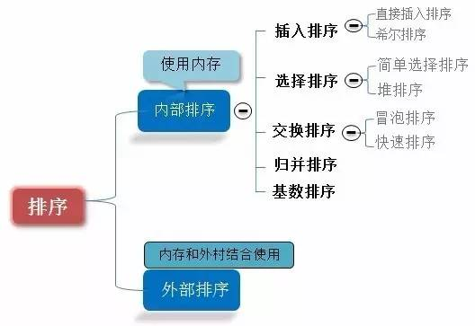

    
    当n较大，则应采用时间复杂度为O(nlog2n)的排序方法：快速排序、堆排序或归并排序序。
   快速排序：是目前基于比较的内部排序中被认为是最好的方法，当待排序的关键字是随机分布时，快速排序的平均时间最短；

 
### 1.插入排序—直接插入排序(Straight Insertion Sort)

#### 基本思想:
将一个记录插入到已排序好的有序表中，从而得到一个新，记录数增1的有序表。即：先将序列的第1个记录看成是一个有序的子序列，然后从第2个记录逐个进行插入，直至整个序列有序为止。
要点：设立哨兵，作为临时存储和判断数组边界之用。
直接插入排序示例：

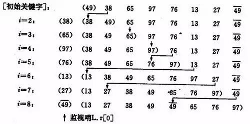

如果碰见一个和插入元素相等的，那么插入元素把想插入的元素放在相等元素的后面。所以，相等元素的前后顺序没有改变，从原无序序列出去的顺序就是排好序后的顺序，所以插入排序是稳定的。

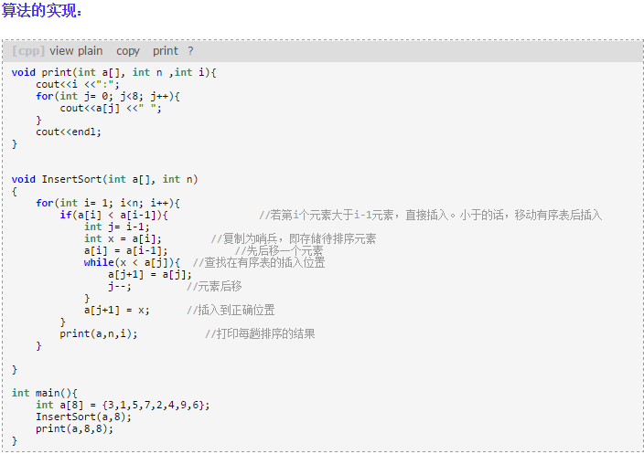

#### 效率：
时间复杂度：O（n^2）.
其他的插入排序有二分插入排序，2-路插入排序。
 
### 2. 插入排序—希尔排序（Shell`s Sort）

希尔排序是1959 年由D.L.Shell 提出来的，相对直接排序有较大的改进。希尔排序又叫缩小增量排序
#### 基本思想：
先将整个待排序的记录序列分割成为若干子序列分别进行直接插入排序，待整个序列中的记录“基本有序”时，再对全体记录进行依次直接插入排序。
操作方法：
选择一个增量序列t1，t2，…，tk，其中ti>tj，tk=1；
按增量序列个数k，对序列进行k 趟排序；
每趟排序，根据对应的增量ti，将待排序列分割成若干长度为m 的子序列，分别对各子表进行直接插入排序。仅增量因子为1 时，整个序列作为一个表来处理，表长度即为整个序列的长度。
希尔排序的示例：

#### 算法实现：
 
我们简单处理增量序列：增量序列d = {n/2 ,n/4, n/8 .....1} n为要排序数的个数
即：先将要排序的一组记录按某个增量d（n/2,n为要排序数的个数）分成若干组子序列，每组中记录的下标相差d.对每组中全部元素进行直接插入排序，然后再用一个较小的增量（d/2）对它进行分组，在每组中再进行直接插入排序。继续不断缩小增量直至为1，最后使用直接插入排序完成排序。
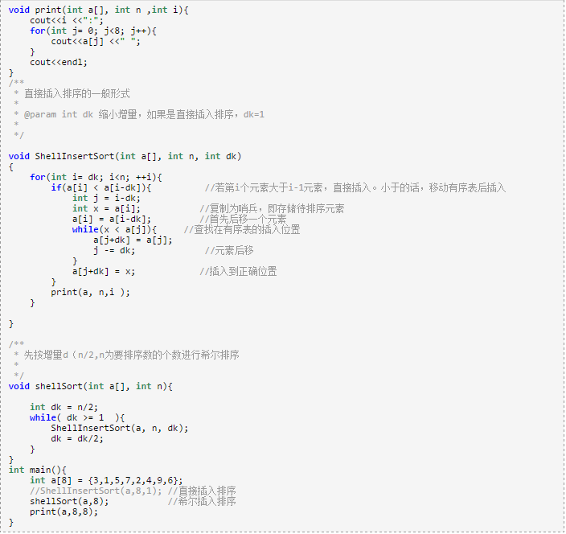
希尔排序时效分析很难，关键码的比较次数与记录移动次数依赖于增量因子序列d的选取，特定情况下可以准确估算出关键码的比较次数和记录的移动次数。目前还没有人给出选取最好的增量因子序列的方法。增量因子序列可以有各种取法，有取奇数的，也有取质数的，但需要注意：增量因子中除1 外没有公因子，且最后一个增量因子必须为1。希尔排序方法是一个不稳定的排序方法。

### 3. 选择排序—简单选择排序（Simple Selection Sort）

#### 基本思想：
在要排序的一组数中，选出最小（或者最大）的一个数与第1个位置的数交换；然后在剩下的数当中再找最小（或者最大）的与第2个位置的数交换，依次类推，直到第n-1个元素（倒数第二个数）和第n个元素（最后一个数）比较为止。
简单选择排序的示例：

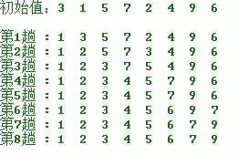
 
#### 操作方法：
第一趟，从n 个记录中找出关键码最小的记录与第一个记录交换；
第二趟，从第二个记录开始的n-1 个记录中再选出关键码最小的记录与第二个记录交换；
以此类推.....
第i 趟，则从第i 个记录开始的n-i+1 个记录中选出关键码最小的记录与第i 个记录交换，
直到整个序列按关键码有序。

#### 算法实现：
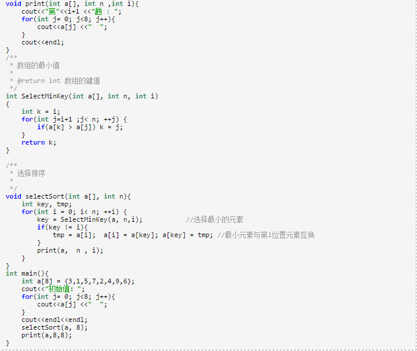

#### 简单选择排序的改进——二元选择排序
简单选择排序，每趟循环只能确定一个元素排序后的定位。我们可以考虑改进为每趟循环确定两个元素（当前趟最大和最小记录）的位置,从而减少排序所需的循环次数。改进后对n个数据进行排序，最多只需进行[n/2]趟循环即可。具体实现如下：
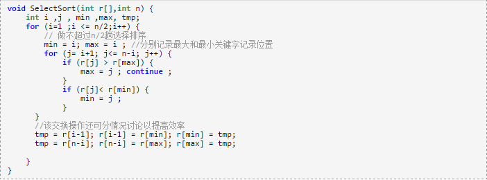

### 4. 选择排序—堆排序（Heap Sort）

堆排序是一种树形选择排序，是对直接选择排序的有效改进。
#### 基本思想：
堆的定义如下：具有n个元素的序列（k1,k2,...,kn),当且仅当满足

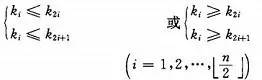

时称之为堆。由堆的定义可以看出，堆顶元素（即第一个元素）必为最小项（小顶堆）。
若以一维数组存储一个堆，则堆对应一棵完全二叉树，且所有非叶结点的值均不大于(或不小于)其子女的值，根结点（堆顶元素）的值是最小(或最大)的。如：
（a）大顶堆序列：（96, 83,27,38,11,09)
 (b)  小顶堆序列：（12，36，24，85，47，30，53，91）
 
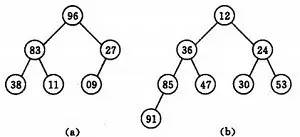

初始时把要排序的n个数的序列看作是一棵顺序存储的二叉树（一维数组存储二叉树），调整它们的存储序，使之成为一个堆，将堆顶元素输出，得到n 个元素中最小(或最大)的元素，这时堆的根节点的数最小（或者最大）。然后对前面(n-1)个元素重新调整使之成为堆，输出堆顶元素，得到n 个元素中次小(或次大)的元素。依此类推，直到只有两个节点的堆，并对它们作交换，最后得到有n个节点的有序序列。称这个过程为堆排序。
因此，实现堆排序需解决两个问题：
1. 如何将n 个待排序的数建成堆；
2. 输出堆顶元素后，怎样调整剩余n-1 个元素，使其成为一个新堆。

首先讨论第二个问题：输出堆顶元素后，对剩余n-1元素重新建成堆的调整过程。
调整小顶堆的方法：
1）设有m 个元素的堆，输出堆顶元素后，剩下m-1 个元素。将堆底元素送入堆顶（（最后一个元素与堆顶进行交换），堆被破坏，其原因仅是根结点不满足堆的性质。
2）将根结点与左、右子树中较小元素的进行交换。
3）若与左子树交换：如果左子树堆被破坏，即左子树的根结点不满足堆的性质，则重复方法 （2）.
4）若与右子树交换，如果右子树堆被破坏，即右子树的根结点不满足堆的性质。则重复方法 （2）.
5）继续对不满足堆性质的子树进行上述交换操作，直到叶子结点，堆被建成。
称这个自根结点到叶子结点的调整过程为筛选。如图：

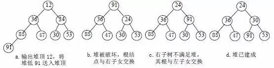

再讨论对n 个元素初始建堆的过程。
建堆方法：对初始序列建堆的过程，就是一个反复进行筛选的过程。
1）n 个结点的完全二叉树，则最后一个结点是第
个结点的子树。
2）筛选从第
个结点为根的子树开始，该子树成为堆。
3）之后向前依次对各结点为根的子树进行筛选，使之成为堆，直到根结点。
如图建堆初始过程：无序序列：（49，38，65，97，76，13，27，49）

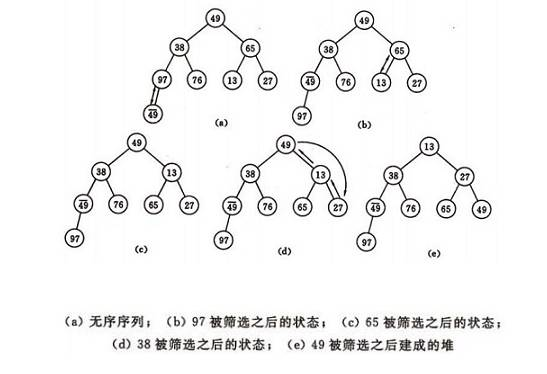
 
#### 算法的实现：
从算法描述来看，堆排序需要两个过程，一是建立堆，二是堆顶与堆的最后一个元素交换位置。所以堆排序有两个函数组成。一是建堆的渗透函数，二是反复调用渗透函数实现排序的函数。

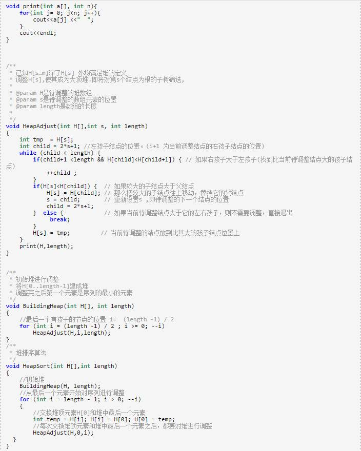
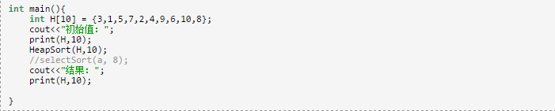

#### 分析:
设树深度为k，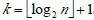
。从根到叶的筛选，元素比较次数至多2(k-1)次，交换记录至多k 次。所以，在建好堆后，排序过程中的筛选次数不超过下式： 

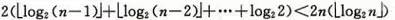                                

而建堆时的比较次数不超过4n 次，因此堆排序最坏情况下，时间复杂度也为：O(nlogn )。
 
### 5. 交换排序—冒泡排序（Bubble Sort）

#### 基本思想：
在要排序的一组数中，对当前还未排好序的范围内的全部数，自上而下对相邻的两个数依次进行比较和调整，让较大的数往下沉，较小的往上冒。即：每当两相邻的数比较后发现它们的排序与排序要求相反时，就将它们互换。
冒泡排序的示例：

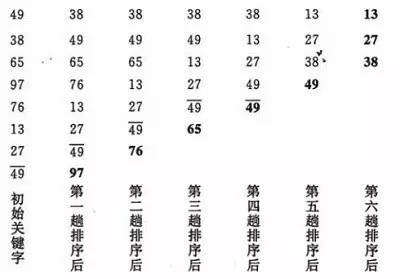

#### 算法的实现：

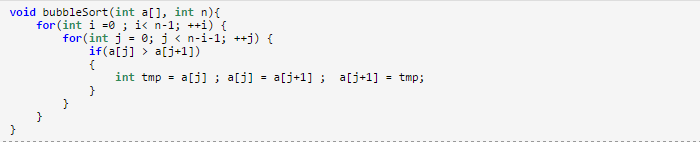

#### 冒泡排序算法的改进
对冒泡排序常见的改进方法是加入一标志性变量exchange，用于标志某一趟排序过程中是否有数据交换，如果进行某一趟排序时并没有进行数据交换，则说明数据已经按要求排列好，可立即结束排序，避免不必要的比较过程。本文再提供以下两种改进算法：
1．设置一标志性变量pos,用于记录每趟排序中最后一次进行交换的位置。由于pos位置之后的记录均已交换到位,故在进行下一趟排序时只要扫描到pos位置即可。
改进后算法如下:

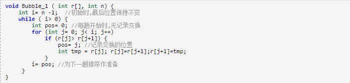

2．传统冒泡排序中每一趟排序操作只能找到一个最大值或最小值,我们考虑利用在每趟排序中进行正向和反向两遍冒泡的方法一次可以得到两个最终值(最大者和最小者) , 从而使排序趟数几乎减少了一半。
改进后的算法实现为:

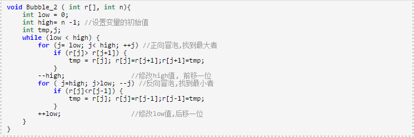

### 6. 交换排序—快速排序（Quick Sort）

#### 基本思想：
1）选择一个基准元素,通常选择第一个元素或者最后一个元素,
2）通过一趟排序讲待排序的记录分割成独立的两部分，其中一部分记录的元素值均比基准元素值小。另一部分记录的 元素值比基准值大。
3）此时基准元素在其排好序后的正确位置
4）然后分别对这两部分记录用同样的方法继续进行排序，直到整个序列有序。
快速排序的示例：
（a）一趟排序的过程：

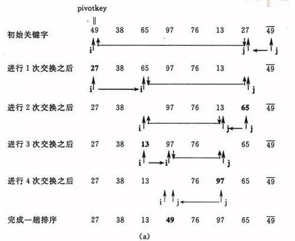

（b）排序的全过程

 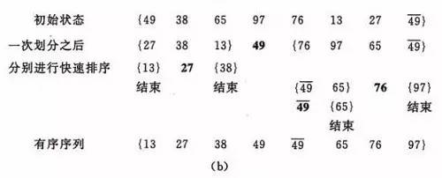

算法的实现：
 递归实现：

 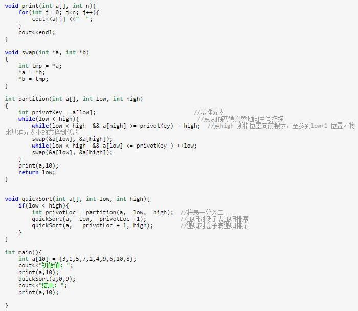

#### 分析：
快速排序是通常被认为在同数量级（O(nlog2n)）的排序方法中平均性能最好的。但若初始序列按关键码有序或基本有序时，快排序反而蜕化为冒泡排序。为改进之，通常以“三者取中法”来选取基准记录，即将排序区间的两个端点与中点三个记录关键码居中的调整为支点记录。快速排序是一个不稳定的排序方法。
 
#### 快速排序的改进
在本改进算法中,只对长度大于k的子序列递归调用快速排序,让原序列基本有序，然后再对整个基本有序序列用插入排序算法排序。实践证明，改进后的算法时间复杂度有所降低，且当k取值为 8 左右时,改进算法的性能最佳。算法思想如下：

 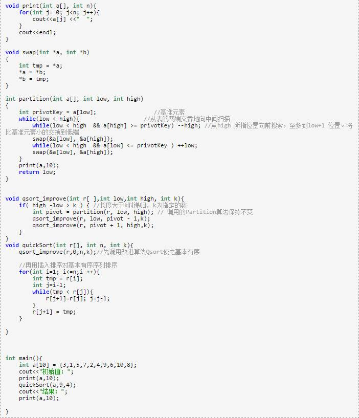

### 7. 归并排序（Merge Sort）

#### 基本思想：
归并（Merge）排序法是将两个（或两个以上）有序表合并成一个新的有序表，即把待排序序列分为若干个子序列，每个子序列是有序的。然后再把有序子序列合并为整体有序序列。
归并排序示例：

 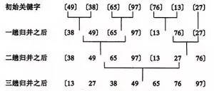
 
#### 合并方法：
设r[i…n]由两个有序子表r[i…m]和r[m+1…n]组成，两个子表长度分别为n-i +1、n-m。
1. j=m+1；k=i；i=i; //置两个子表的起始下标及辅助数组的起始下标
2. 若i>m 或j>n，转⑷ //其中一个子表已合并完，比较选取结束
3. //选取r[i]和r[j]较小的存入辅助数组rf
如果r[i]<r[j]，rf[k]=r[i]； i++； k++； 转⑵
否则，rf[k]=r[j]； j++； k++； 转⑵
4. //将尚未处理完的子表中元素存入rf
如果i<=m，将r[i…m]存入rf[k…n] //前一子表非空
如果j<=n ,  将r[j…n] 存入rf[k…n] //后一子表非空
5. 合并结束。

 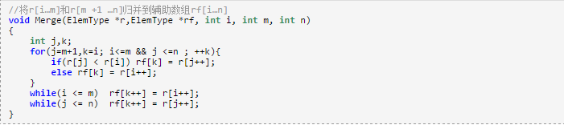

#### 归并的迭代算法

1 个元素的表总是有序的。所以对n 个元素的待排序列，每个元素可看成1 个有序子表。对子表两两合并生成n/2个子表，所得子表除最后一个子表长度可能为1 外，其余子表长度均为2。再进行两两合并，直到生成n 个元素按关键码有序的表。

 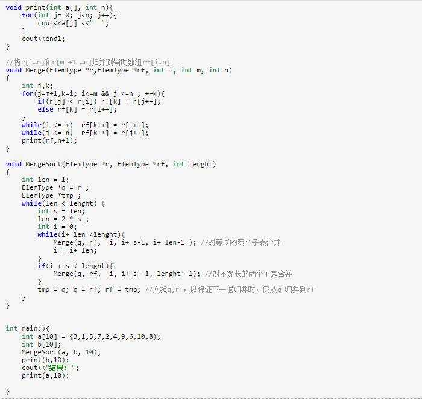

#### 两路归并的递归算法

 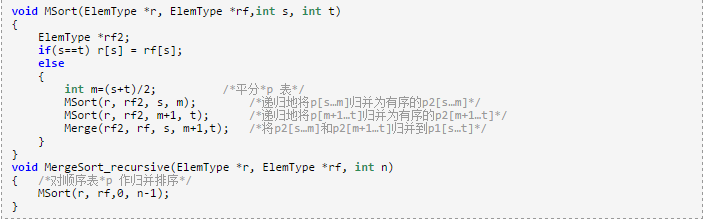

### 8. 桶排序/基数排序(Radix Sort)

说基数排序之前，我们先说桶排序：
#### 基本思想
是将阵列分到有限数量的桶子里。每个桶子再个别排序（有可能再使用别的排序算法或是以递回方式继续使用桶排序进行排序）。桶排序是鸽巢排序的一种归纳结果。当要被排序的阵列内的数值是均匀分配的时候，桶排序使用线性时间（Θ（n））。但桶排序并不是 比较排序，他不受到 O(n log n) 下限的影响。
         简单来说，就是把数据分组，放在一个个的桶中，然后对每个桶里面的在进行排序。 
 例如要对大小为[1..1000]范围内的n个整数A[1..n]排序  
 首先，可以把桶设为大小为10的范围，具体而言，设集合B[1]存储[1..10]的整数，集合B[2]存储   (10..20]的整数，……集合B[i]存储(   (i-1)*10,   i*10]的整数，i   =   1,2,..100。总共有  100个桶。  
  然后，对A[1..n]从头到尾扫描一遍，把每个A[i]放入对应的桶B[j]中。  再对这100个桶中每个桶里的数字排序，这时可用冒泡，选择，乃至快排，一般来说任  何排序法都可以。
  最后，依次输出每个桶里面的数字，且每个桶中的数字从小到大输出，这  样就得到所有数字排好序的一个序列了。  
  假设有n个数字，有m个桶，如果数字是平均分布的，则每个桶里面平均有n/m个数字。如果对每个桶中的数字采用快速排序，那么整个算法的复杂度是：
  O(n   +   m   *   n/m*log(n/m))   =   O(n   +   nlogn   -   nlogm)  
  从上式看出，当m接近n的时候，桶排序复杂度接近O(n)  
  当然，以上复杂度的计算是基于输入的n个数字是平均分布这个假设的。这个假设是很强的  ，实际应用中效果并没有这么好。如果所有的数字都落在同一个桶中，那就退化成一般的排序了。  
        前面说的几大排序算法 ，大部分时间复杂度都是O（n2），也有部分排序算法时间复杂度是O(nlogn)。而桶式排序却能实现O（n）的时间复杂度。但桶排序的缺点是：
        1）首先是空间复杂度比较高，需要的额外开销大。排序有两个数组的空间开销，一个存放待排序数组，一个就是所谓的桶，比如待排序值是从0到m-1，那就需要m个桶，这个桶数组就要至少m个空间。
        2）其次待排序的元素都要在一定的范围内等等。
       桶式排序是一种分配排序。分配排序的特定是不需要进行关键码的比较，但前提是要知道待排序列的一些具体情况。

分配排序的基本思想：说白了就是进行多次的桶式排序。
基数排序过程无须比较关键字，而是通过“分配”和“收集”过程来实现排序。它们的时间复杂度可达到线性阶：O(n)。
实例:
扑克牌中52 张牌，可按花色和面值分成两个字段，其大小关系为：
花色： 梅花< 方块< 红心< 黑心   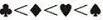

面值： 2 < 3 < 4 < 5 < 6 < 7 < 8 < 9 < 10 < J < Q < K < A
若对扑克牌按花色、面值进行升序排序，得到如下序列：

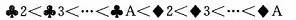
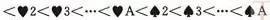

即两张牌，若花色不同，不论面值怎样，花色低的那张牌小于花色高的，只有在同花色情况下，大小关系才由面值的大小确定。这就是多关键码排序。
为得到排序结果，我们讨论两种排序方法。
方法1：先对花色排序，将其分为4 个组，即梅花组、方块组、红心组、黑心组。再对每个组分别按面值进行排序，最后，将4 个组连接起来即可。
方法2：先按13 个面值给出13 个编号组(2 号，3 号，...，A 号)，将牌按面值依次放入对应的编号组，分成13 堆。再按花色给出4 个编号组(梅花、方块、红心、黑心)，将2号组中牌取出分别放入对应花色组，再将3 号组中牌取出分别放入对应花色组，……，这样，4 个花色组中均按面值有序，然后，将4 个花色组依次连接起来即可。
设n 个元素的待排序列包含d 个关键码{k1，k2，…，kd}，则称序列对关键码{k1，k2，…，kd}有序是指：对于序列中任两个记录r[i]和r[j](1≤i≤j≤n)都满足下列有序关系：

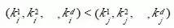

其中k1 称为最主位关键码，kd 称为最次位关键码。
 
#### 两种多关键码排序方法：
多关键码排序按照从最主位关键码到最次位关键码或从最次位到最主位关键码的顺序逐次排序，分两种方法：
最高位优先(Most Significant Digit first)法，简称MSD 法：
1）先按k1 排序分组，将序列分成若干子序列，同一组序列的记录中，关键码k1 相等。
2）再对各组按k2 排序分成子组，之后，对后面的关键码继续这样的排序分组，直到按最次位关键码kd 对各子组排序后。
3）再将各组连接起来，便得到一个有序序列。扑克牌按花色、面值排序中介绍的方法一即是MSD 法。
最低位优先(Least Significant Digit first)法，简称LSD 法：
1) 先从kd 开始排序，再对kd-1进行排序，依次重复，直到按k1排序分组分成最小的子序列后。
2) 最后将各个子序列连接起来，便可得到一个有序的序列, 扑克牌按花色、面值排序中介绍的方法二即是LSD 法。

### 基于LSD方法的链式基数排序的基本思想
　　“多关键字排序”的思想实现“单关键字排序”。对数字型或字符型的单关键字，可以看作由多个数位或多个字符构成的多关键字，此时可以采用“分配-收集”的方法进行排序，这一过程称作基数排序法，其中每个数字或字符可能的取值个数称为基数。比如，扑克牌的花色基数为4，面值基数为13。在整理扑克牌时，既可以先按花色整理，也可以先按面值整理。按花色整理时，先按红、黑、方、花的顺序分成4摞（分配），再按此顺序再叠放在一起（收集），然后按面值的顺序分成13摞（分配），再按此顺序叠放在一起（收集），如此进行二次分配和收集即可将扑克牌排列有序。   
基数排序:
是按照低位先排序，然后收集；再按照高位排序，然后再收集；依次类推，直到最高位。有时候有些属性是有优先级顺序的，先按低优先级排序，再按高优先级排序。最后的次序就是高优先级高的在前，高优先级相同的低优先级高的在前。基数排序基于分别排序，分别收集，所以是稳定的。
#### 算法实现：

 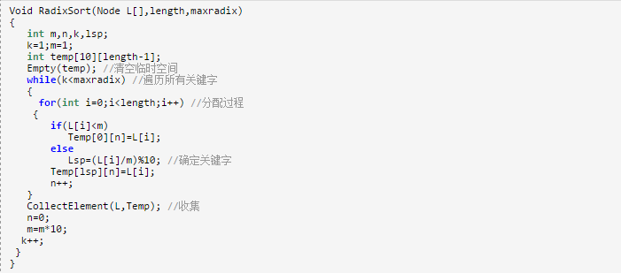

总结

各种排序的稳定性，时间复杂度和空间复杂度总结：

 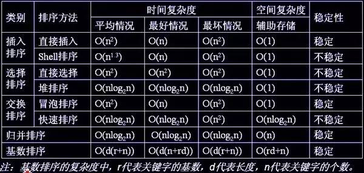

 我们比较时间复杂度函数的情况：

 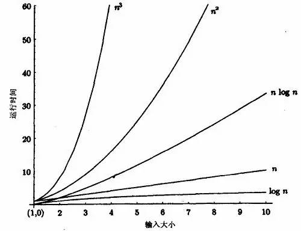

            时间复杂度函数O(n)的增长情况

 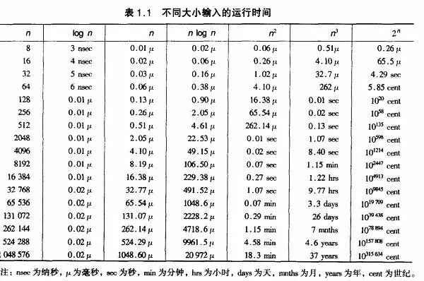

所以对n较大的排序记录。一般的选择都是时间复杂度为O(nlog2n)的排序方法。

时间复杂度来说：
(1)平方阶(O(n2))排序
　　各类简单排序:直接插入、直接选择和冒泡排序；
 (2)线性对数阶(O(nlog2n))排序
　　快速排序、堆排序和归并排序；
 (3)O(n1+§))排序,§是介于0和1之间的常数。
       希尔排序
(4)线性阶(O(n))排序
　　基数排序，此外还有桶、箱排序。
说明：
当原表有序或基本有序时，直接插入排序和冒泡排序将大大减少比较次数和移动记录的次数，时间复杂度可降至O（n）；
而快速排序则相反，当原表基本有序时，将蜕化为冒泡排序，时间复杂度提高为O（n2）；
原表是否有序，对简单选择排序、堆排序、归并排序和基数排序的时间复杂度影响不大。
 
稳定性：
排序算法的稳定性:若待排序的序列中，存在多个具有相同关键字的记录，经过排序， 这些记录的相对次序保持不变，则称该算法是稳定的；若经排序后，记录的相对 次序发生了改变，则称该算法是不稳定的。 
     稳定性的好处：排序算法如果是稳定的，那么从一个键上排序，然后再从另一个键上排序，第一个键排序的结果可以为第二个键排序所用。基数排序就是这样，先按低位排序，逐次按高位排序，低位相同的元素其顺序再高位也相同时是不会改变的。另外，如果排序算法稳定，可以避免多余的比较；
稳定的排序算法：冒泡排序、插入排序、归并排序和基数排序
不是稳定的排序算法：选择排序、快速排序、希尔排序、堆排序
 
选择排序算法准则：
每种排序算法都各有优缺点。因此，在实用时需根据不同情况适当选用，甚至可以将多种方法结合起来使用。
选择排序算法的依据
影响排序的因素有很多，平均时间复杂度低的算法并不一定就是最优的。相反，有时平均时间复杂度高的算法可能更适合某些特殊情况。同时，选择算法时还得考虑它的可读性，以利于软件的维护。一般而言，需要考虑的因素有以下四点：
1．待排序的记录数目n的大小；
2．记录本身数据量的大小，也就是记录中除关键字外的其他信息量的大小；
3．关键字的结构及其分布情况；
4．对排序稳定性的要求。
设待排序元素的个数为n.
1）当n较大，则应采用时间复杂度为O(nlog2n)的排序方法：快速排序、堆排序或归并排序序。
   快速排序：是目前基于比较的内部排序中被认为是最好的方法，当待排序的关键字是随机分布时，快速排序的平均时间最短；
       堆排序 ：  如果内存空间允许且要求稳定性的，
       归并排序：它有一定数量的数据移动，所以我们可能过与插入排序组合，先获得一定长度的序列，然后再合并，在效率上将有所提高。
2）  当n较大，内存空间允许，且要求稳定性 =》归并排序
3）当n较小，可采用直接插入或直接选择排序。
    直接插入排序：当元素分布有序，直接插入排序将大大减少比较次数和移动记录的次数。
    直接选择排序 ：元素分布有序，如果不要求稳定性，选择直接选择排序
5）一般不使用或不直接使用传统的冒泡排序。
6）基数排序
它是一种稳定的排序算法，但有一定的局限性：
　　1、关键字可分解。
　　2、记录的关键字位数较少，如果密集更好
　　3、如果是数字时，最好是无符号的，否则将增加相应的映射复杂度，可先将其正负分开排序。
 
转载自：http://blog.csdn.net/hguisu/article/details/7776068
